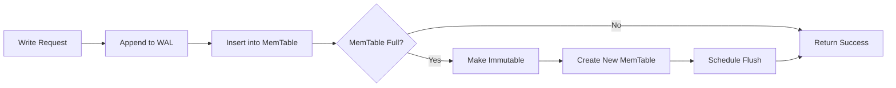
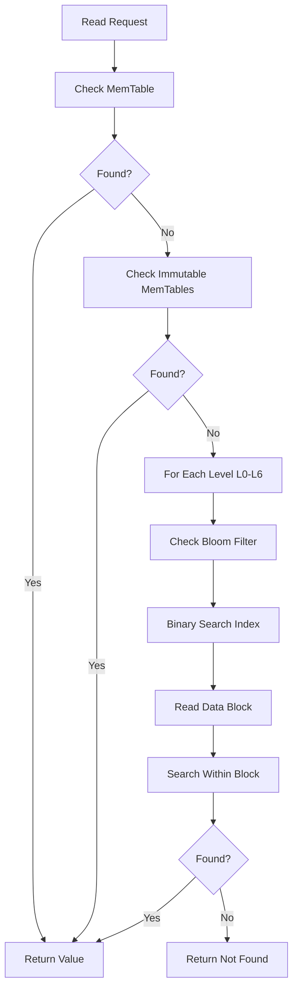

import { Aside, Card, CardGrid, Tabs, TabItem, Badge, Steps } from "@astrojs/starlight/components";

FerrisDB implements a custom LSM-tree (Log-Structured Merge-tree) storage engine from scratch. This
document details the design and implementation of each component.

## Architecture

```text
┌─────────────────────────────────────────────────────────┐
│                    Write Path                           │
│  Write Request → WAL → MemTable → (Flush) → SSTable     │
└─────────────────────────────────────────────────────────┘

┌─────────────────────────────────────────────────────────┐
│                     Read Path                           │
│  Read Request → MemTable → Immutable MemTables →        │
│                 L0 SSTables → L1 SSTables → ...         │
└─────────────────────────────────────────────────────────┘
```

## Components

### 1. Write-Ahead Log (WAL)

The WAL ensures durability by persisting all writes before they're applied to the MemTable.

<Tabs>
  <TabItem label="Design">
    - Append-only log file with sequential writes
    - Each entry contains: `[length][checksum][key_len][key][value_len][value][timestamp]`
    - Sync to disk after each write (configurable)
    - Rotation when file reaches size limit (default: 64MB)
  </TabItem>
  
  <TabItem label="Format">
    ```rust
    struct WALEntry {
        length: u32,          // Total entry length
        checksum: u32,        // CRC32 checksum
        timestamp: u64,       // Transaction timestamp
        operation: u8,        // Put = 1, Delete = 2
        key_len: u32,
        key: Vec<u8>,
        value_len: u32,       // 0 for deletes
        value: Vec<u8>,
    }
    ```
  </TabItem>
</Tabs>

### 2. MemTable

In-memory sorted structure for recent writes. We implement a concurrent skip list for O(log n)
operations.

<CardGrid>
  <Card title="Design Features" icon="rocket">
    - Lock-free skip list with max height 12
    - Thread-safe using epoch-based reclamation
    - Size limit triggers flush (default: 4MB)
    - Concurrent reads during writes
  </Card>
  
  <Card title="Skip List Structure" icon="seti:code">
    ```rust
    struct SkipListNode<K, V> {
        key: K,
        value: V,
        timestamp: u64,
        next: Vec<AtomicPtr<SkipListNode<K, V>>>,
    }
    ```
  </Card>
</CardGrid>

### 3. SSTable (Sorted String Table)

Immutable on-disk files storing sorted key-value pairs.

#### File Format

```text
┌─────────────┐
│   Header    │ - Magic number, version, metadata
├─────────────┤
│ Data Blocks │ - Sorted KV pairs in 4KB blocks
├─────────────┤
│Index Blocks │ - Block offsets for binary search
├─────────────┤
│ Bloom Filter│ - Optional, for existence checks
├─────────────┤
│   Footer    │ - Index offset, bloom offset, checksum
└─────────────┘
```

<Tabs>
  <TabItem label="Data Block Format">
    - Prefix compression for keys - Restart points every 16 keys - Block compression (LZ4 or Snappy)
  </TabItem>

  <TabItem label="Index Format">
    - One entry per data block - Contains: last key in block + block offset - Enables binary search
    across blocks
  </TabItem>
</Tabs>

### 4. Compaction

Merges and organizes SSTables to maintain read performance.

<Aside type="tip" title="Leveled Compaction Strategy">
  - **L0**: Direct flushes from MemTable (overlapping) - **L1-L6**: Non-overlapping, exponentially
  larger - **Size ratios**: L0=10MB, L1=100MB, L2=1GB, etc.
</Aside>

<Steps>
  1. Select candidate files based on size/age 2. Merge overlapping key ranges 3. Apply tombstone
  deletion 4. Write new SSTable(s) 5. Atomically update manifest 6. Delete old files
</Steps>

### 5. Manifest

Tracks the current version of the database and all live SSTable files.

```rust
struct Manifest {
    version: u64,
    levels: Vec<Level>,
    sequence_number: u64,
    log_number: u64,
}

struct FileMetadata {
    number: u64,
    size: u64,
    smallest_key: Vec<u8>,
    largest_key: Vec<u8>,
    smallest_timestamp: u64,
    largest_timestamp: u64,
}
```

### 6. Block Cache

LRU cache for frequently accessed SSTable blocks.

<Card title="Cache Design" icon="setting">
  - Sharded by key hash to reduce contention - Configurable size (default: 128MB) - Tracks access
  patterns for adaptive caching
</Card>

### 7. Bloom Filters

Probabilistic data structure to avoid unnecessary disk reads.

- **Bits per key**: 10 (1% false positive rate)
- **Hash functions**: MurmurHash3
- **Storage**: In SSTable footer

## Operations

### Write Operation



### Read Operation



### Delete Operation

<Aside type="note">
  Deletes insert tombstone markers. Actual deletion happens during compaction. Tombstones have
  timestamps for MVCC.
</Aside>

## Optimizations

<Tabs>
  <TabItem label="Write Optimizations">
    - Group commit for WAL - Parallel MemTable and WAL writes - Write batching API
  </TabItem>

<TabItem label="Read Optimizations">
  - Bloom filters to skip files - Block cache for hot data - Parallel searches across levels -
  Read-ahead for sequential scans
</TabItem>

  <TabItem label="Memory Management">
    - Memory-mapped files for read-only SSTables - Direct I/O to bypass OS cache - Custom allocators
    for MemTable
  </TabItem>
</Tabs>

## Configuration

```rust
struct StorageConfig {
    // WAL
    wal_dir: PathBuf,
    wal_sync_mode: SyncMode,
    wal_size_limit: usize,

    // MemTable
    memtable_size: usize,
    max_immutable_memtables: usize,

    // SSTable
    block_size: usize,
    compression: CompressionType,

    // Compaction
    level0_file_num_compaction_trigger: i32,
    max_bytes_for_level_base: u64,
    max_bytes_for_level_multiplier: f64,

    // Cache
    block_cache_size: usize,
    bloom_filter_bits_per_key: i32,
}
```

## Testing Strategy

<CardGrid>
  <Card title="Correctness Tests" icon="checkmark">
    - Single-threaded operations - Concurrent operations - Crash recovery - Compaction correctness
  </Card>

<Card title="Performance Tests" icon="rocket">
  - Write throughput - Read latency - Mixed workloads - Large value handling
</Card>

  <Card title="Stress Tests" icon="warning">
    - Random operations with verification - Crash injection - Disk full scenarios - Memory pressure
  </Card>
</CardGrid>

## Implementation Progress

### ✅ Phase 1: Basic Functionality

<Badge text="COMPLETED" variant="success" />

- [x] Simple WAL with binary encoding
- [x] Concurrent skip list MemTable
- [x] Basic SSTable writer/reader (skeleton)
- [x] MVCC support with timestamps

### 🚧 Phase 2: Performance

<Badge text="IN PROGRESS" variant="caution" />

- [ ] Complete SSTable implementation
- [ ] Bloom filters
- [ ] Block cache
- [ ] Automatic compaction

### ⏳ Phase 3: Advanced Features

<Badge text="PLANNED" variant="note" />

- [ ] Compression
- [ ] Column families
- [ ] Backup/restore
- [ ] Statistics collection

## Current Implementation Status

As of Day 3, we have successfully implemented:

<Tabs>
  <TabItem label="✅ Write-Ahead Log">
    - Binary format with CRC32 checksums - Little-endian encoding for cross-platform compatibility -
    Atomic writes with proper error handling - Recovery by replaying log entries
  </TabItem>

<TabItem label="✅ MemTable">
  - Lock-free implementation using crossbeam - MVCC support with timestamp-based versioning - Proper
  key ordering: (user_key ASC, timestamp DESC) - Epoch-based memory reclamation for thread safety
</TabItem>

  <TabItem label="🚧 Next Steps">
    - Complete SSTable format implementation - Add bloom filters for read optimization - Implement
    compaction strategy - Add comprehensive integration tests
  </TabItem>
</Tabs>

## References

- LevelDB Implementation Notes
- RocksDB Wiki
- WiredTiger Architecture Guide
- "The Log-Structured Merge-Tree" paper

## Related Documentation

- [Overall Architecture](/reference/architecture/)
- [Database Concepts Articles](/concepts/database-internals/lsm-trees/)
- [Development Blog](/blog/)
